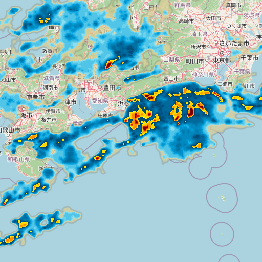

# Planning a weekend trip — Tokyo

> **You:** What's the weather looking like in Tokyo for the next three days? We're planning an evening harbor cruise — will the moon be out?

**Claude Code answered** (using this server's `get_forecast` tool):

<!-- answer -->
Here's the three-day outlook for Tokyo:

- **Monday, Sep 28** — slight rain, 90% chance (0.40 in), high 78°F / low 70°F, and muggy: it feels like 87°F.
- **Tuesday, Sep 29** — the wet one: moderate rain, 99% chance, 1.37 in, high 71°F / low 66°F.
- **Wednesday, Sep 30** — cooler, high 67°F / low 65°F, with a 67% chance of moderate rain.

About the harbor cruise: **yes, the moon will be out** — if the rain gives you a gap. Monday's moon is 97% illuminated and rises at 6:03 PM, about half an hour after the 5:29 PM sunset, so it will be climbing over the water just as civil twilight ends around 5:55 PM. Tuesday is almost as good (93%, rising 6:37 PM), but that's the day with the heaviest rain. Monday evening is your best bet.
<!-- /answer -->

---

<!-- capture:tokyo-forecast -->
<details>
<summary>🔍 Tool call & raw server output — <code>get_forecast</code></summary>

**Call:**

```js
get_forecast({
  city_name: "Tokyo, Japan",
  days: 3,
  include_astronomy: true
})
```

**The server returned** (verbatim — this is exactly what the MCP client receives):

````markdown
**Location:** Tokyo, Japan (35.6769, 139.7639)

# Weather Forecast (Daily)

**Location:** 35.6769, 139.7639
**Elevation:** 89ft
**Timezone:** Asia/Tokyo
**Forecast Days:** 3

## Monday, September 28
**Temperature:** High 78°F / Low 70°F
**Feels Like:** High 87°F / Low 76°F
**Sunrise:** 5:33 AM
**Sunset:** 5:29 PM
**Moon:** Full Moon (97% illuminated) · Rise 6:03 PM · Set 6:56 AM
**Twilight:** Civil 5:07 AM / 5:55 PM · Nautical 4:38 AM / 6:24 PM · Astronomical 4:08 AM / 6:54 PM
**Daylight Duration:** 11h 56m
**Precipitation Chance:** 90%
**Precipitation:** 0.40 in
**Wind:** 3 mph SSW
**Wind Gusts:** 12 mph
**Conditions:** Slight rain
**UV Index:** 3.3

## Tuesday, September 29
**Temperature:** High 71°F / Low 66°F
**Feels Like:** High 78°F / Low 70°F
**Sunrise:** 5:33 AM
**Sunset:** 5:28 PM
**Moon:** Waning Gibbous (93% illuminated) · Rise 6:37 PM · Set 8:05 AM
**Twilight:** Civil 5:08 AM / 5:53 PM · Nautical 4:38 AM / 6:23 PM · Astronomical 4:08 AM / 6:53 PM
**Daylight Duration:** 11h 54m
**Precipitation Chance:** 99%
**Precipitation:** 1.37 in
**Wind:** 3 mph W
**Wind Gusts:** 11 mph
**Conditions:** Moderate rain
**UV Index:** 0.3

## Wednesday, September 30
**Temperature:** High 67°F / Low 65°F
**Feels Like:** High 70°F / Low 68°F
**Sunrise:** 5:34 AM
**Sunset:** 5:26 PM
**Moon:** Waning Gibbous (86% illuminated) · Rise 7:18 PM · Set 9:18 AM
**Twilight:** Civil 5:09 AM / 5:52 PM · Nautical 4:39 AM / 6:21 PM · Astronomical 4:09 AM / 6:51 PM
**Daylight Duration:** 11h 52m
**Precipitation Chance:** 67%
**Precipitation:** 0.78 in
**Wind:** 3 mph NNE
**Wind Gusts:** 17 mph
**Conditions:** Moderate rain
**UV Index:** 2.4

**Next full moon:** Oct 26 · **Next new moon:** Oct 11

---
*Data source: Open-Meteo (Global)*
````

</details>
<!-- /capture:tokyo-forecast -->

> **You:** Is it raining there right now? Show me the radar.

**Claude Code answered** (using `get_weather_imagery`):

<!-- answer-2 -->
Not over central Tokyo yet. The current radar frame (11:30 AM Monday, Tokyo time) shows the city itself mostly dry, but a broad rain band sits just to the south and southwest — over Sagami Bay and the Izu Peninsula — with heavier storm cells, the orange-and-red cores, along the Shizuoka coast. That fits the forecast for today: a 90% chance of slight rain.
<!-- /answer-2 -->



*A snapshot committed at capture time: the radar tile the server returned, composited onto a map base layer so the echoes have geography under them. The raw tile itself is a transparent precipitation overlay — blank where dry — and RainViewer's frame URLs expire within about two hours, which is why the server's output also includes an **interactive map** link for the live, animated view. Radar © RainViewer · base map © [OpenStreetMap](https://www.openstreetmap.org/copyright) contributors.*

<!-- capture:tokyo-radar -->
<details>
<summary>🔍 Tool call & raw server output — <code>get_weather_imagery</code></summary>

**Call:**

```js
get_weather_imagery({
  latitude: 35.6769,
  longitude: 139.7639,
  type: "radar"
})
```

**The server returned** (verbatim — this is exactly what the MCP client receives):

````markdown
# Weather Imagery

**Location:** 35.6769, 139.7639
**Type:** Radar
**Coverage:** Global
**Resolution:** Latest snapshot
**Source:** RainViewer
**Animated:** No

## 📸 Current Imagery

**Timestamp:** 2026-09-28T02:30:00.000Z
**Image URL:** https://tilecache.rainviewer.com/v2/radar/ae64cc57402d/512/6/56/25/4/1_1.png

**Interactive map:** https://www.rainviewer.com/map.html?loc=35.6769,139.7639,7
*Opens live animated radar over a base map in the browser — the frame URLs above are transparent overlay tiles (blank where dry) and expire within about two hours.*

---

⚠️ **DISCLAIMER:** RainViewer provides global precipitation radar. Data may have 5-10 minute delay. For official forecasts, consult local meteorological services.

---
*Generated: 2026-09-28T02:30:51.736Z*
*Data source: RainViewer*
````

</details>
<!-- /capture:tokyo-radar -->

> **You:** Before we head out on the harbor cruise tonight — any weather warnings in effect for Tokyo?

**Claude Code answered** (using `get_alerts`):

<!-- answer-3 -->
Yes — one. The Japan Meteorological Agency has a **雷注意報 (Advisory for Thunderstorm)** in force for 東京地方 (Tokyo Region), status 継続 (continuing), in the bulletin issued at 11:29 AM today, Tokyo time. It is an advisory rather than a full warning, but lightning is exactly the hazard that matters on an open deck. Check with the cruise operator before you board, and keep an eye on the storm cells to the southwest on the radar. The bulletin carries three more warnings, but they are for other areas and do not cover Tokyo.
<!-- /answer-3 -->

<!-- capture:tokyo-alerts -->
<details>
<summary>🔍 Tool call & raw server output — <code>get_alerts</code></summary>

**Call:**

```js
get_alerts({
  latitude: 35.6769,
  longitude: 139.7639,
  detail: "full"
})
```

**The server returned** (verbatim — this is exactly what the MCP client receives):

````markdown
# Weather Alerts — Japan

**Location:** 35.6769, 139.7639

⚠️ **1 active warning for 東京地方 (Tokyo Region)**

*Issued by 気象庁 at 2026-09-28T11:29:00+09:00.*

### 雷注意報 — Advisory for Thunderstorm
- **Status:** 継続
- **JMA code:** 14

*3 further warnings in force in other areas of the same bulletin, not covering this location.*

---
*出典：気象庁ホームページ (Source: Japan Meteorological Agency Homepage) — https://www.jma.go.jp/bosai/warning/*
*Warning names are shown as published; English glosses are added for convenience.*
````

</details>
<!-- /capture:tokyo-alerts -->

---

**Features shown:** `city_name` free-text geocoding (no coordinates needed) · `include_astronomy` (moon phase, moonrise/moonset, twilight times — computed locally, no extra API call) · `days` forecast-length control · `get_weather_imagery` radar (RainViewer) with a committed snapshot.

<!-- capture-stamp -->
*Captured 2026-09-28 — raw output is live data and will differ when regenerated (`npm run examples`).*
<!-- /capture-stamp -->
